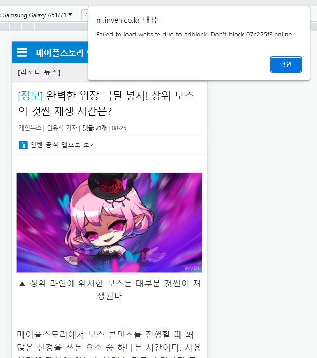

# adblockscript

23년 8월 28일 기준 광고 차단 프로그램을 사용하면서 인벤 모바일을 웹서핑해도 광고차단이 잘 되지 않는다.

## 애드가드만 사용한 경우

이미지에서는 상단에만 광고가 있지만, 하단에도 광고가 있다.


해당 광고는 애드실드광고이다.

애드실드광고는 다음 스크립트를 이용해서 막는다.

<a href = "https://github.com/List-KR/microShield">마이크로실드 바로가기</a>

만약 마이크로실드를 인젝션시키면 애드실드 스크립트에 의해 다음과 같이 된다.



다음과 같은 Alert문이 발생하면서,


내용이 남아는 있지만 CSS구조가 변형되어서 알아보기가 어렵게 된다.

## 해결 스크립트

다음 스크립트를 마이크로실드와 함께 인젝션 시키면 해결된다.

```
https://cdn.jsdelivr.net/gh/kkt3343/adblockscript@main/BlockAdshield_InvenMobileSite_1.user.js
```

<a href = "https://cdn.jsdelivr.net/gh/kkt3343/adblockscript@main/BlockAdshield_InvenMobileSite_1.user.js">코드 다운로드</a>

사파리 환경에서도 작동하는 것을 확인했습니다.

광고차단은 광고주와의 창과 방패 싸움이라 생각합니다.

해당 스크립트는 언제든 막힐 수 있다고 생각합니다.

다만 자바스크립트 비동기를 이용한 애드블럭을 막는 코드와 함께 공부가 되는 좋은 경험이였습니다.


